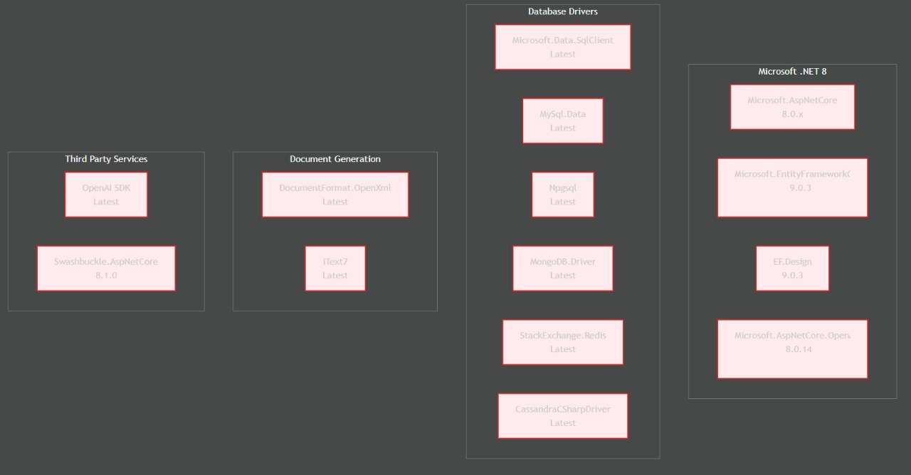

# UNIVERSIDAD PRIVADA DE TACNA
## FACULTAD DE INGENIERÍA
### Escuela Profesional de Ingeniería de Sistemas

# Aplicación para la Generación Automatizada de un Diccionario de Datos

**Curso:** Patrones de Software

**Docente:** Mag. Patrick Cuadros Quiroga

**Integrantes:**

*   Daleska Nicolle Fernandez Villanueva (2021070308)
*   Andree Sebastián Flores Meléndez (2017057494)
*   Mario Antonio Flores Ramos (2018000597)

 

**Tacna – Perú**
**2025**

---

### CONTROL DE VERSIONES
| Versión | Hecha por | Revisada por | Aprobada por | Fecha      | Motivo           |
|---------|-----------|--------------|--------------|------------|------------------|
| 2.0     | AFM       | AFM          | AFM          | 11/06/2025 | Versión Original |

---

 

# Aplicación para la Generación Automatizada de un Diccionario de Datos
## Documento de Arquitectura de Software
### Versión 2.0

 

### CONTROL DE VERSIONES
| Versión | Hecha por | Revisada por | Aprobada por | Fecha      | Motivo           |
|---------|-----------|--------------|--------------|------------|------------------|
| 2.0     | AFM       | AFM          | AFM          | 11/06/2025 | Versión Original |

---

# 1. INTRODUCCIÓN

## 1.1. Propósito (Diagrama 4+1)
La Aplicación para la Generación Automatizada de un Diccionario de Datos tiene como objetivo crear una herramienta que permita extraer, organizar y generar un diccionario de datos de forma rápida y precisa. Facilitará la documentación y el análisis de bases de datos, ayudando a desarrolladores y administradores a crear diccionarios de forma eficiente, optimizando el proceso y reduciendo significativamente el tiempo de trabajo.

Desde una visión global de arquitectura basada en el modelo 4+1:
*   **Vista lógica:** módulos que extraen, procesan y presentan los datos.
*   **Vista de procesos:** prioriza la eficiencia para procesar grandes bases de datos rápidamente.
*   **Vista de desarrollo:** estructura modular y fácil de mantener.
*   **Vista física:** se puede instalar en servidores locales o en la nube.

## 1.2. Alcance
El sistema se encargará de:
*   Extraer la estructura de la base de datos (tablas, columnas, tipos de datos, relaciones y restricciones).
*   Generar una representación en formato exportable a PDF o Word.
*   Integrarse con bases de datos relacionales como SQL, con la posibilidad de expandirse a otros motores en el futuro.
*   Brindar una interfaz intuitiva para la navegación y exportación de la información.

## 1.3. Definición, siglas y abreviaturas
*   **Diccionario de Datos:** Documento que describe la estructura de una base de datos, incluyendo sus entidades, atributos y relaciones.
*   **ERD (Entity-Relationship Diagram):** Representación gráfica de las relaciones entre entidades en una base de datos.

---

# 2. OBJETIVOS Y RESTRICCIONES ARQUITECTÓNICAS
El objetivo es desarrollar una aplicación web que automatice la extracción, organización y generación de diccionarios de datos a partir de bases de datos relacionales, optimizando el proceso de documentación y facilitando su análisis y actualización.

### Priorización de requerimientos
| ID. Requerimiento | Nombre del Requisito | Descripción de Requisito | Prioridad |
| :--- | :--- | :--- | :--- |
| **CU-001** | Iniciar Sesión | El sistema debe permitir a los usuarios autenticarse mediante un formulario de inicio de sesión con su usuario y contraseña para poder acceder a las funcionalidades de la aplicación. El sistema validará las credenciales y mostrará un mensaje de error si son incorrectas. | Alta |
| **CU-002** | Registrar Usuario | El sistema debe permitir a un nuevo usuario registrarse proporcionando una dirección de correo electrónico, nombre de usuario y contraseña. El sistema debe validar que las credenciales sean únicas y, una vez registrado, el usuario podrá iniciar sesión. | Alta |
| **CU-003** | Conectar a la Base de Datos | El sistema debe permitir al usuario ingresar los parámetros necesarios (host, usuario, contraseña, nombre BD) para establecer una conexión. La aplicación debe validar los campos, intentar la conexión y notificar al usuario con un mensaje claro de éxito o error. | Alta |
| **CU-004** | Extracción Automática de Estructura | Una vez conectado a la base de datos, el sistema debe extraer de forma automática la estructura completa de todas las tablas, incluyendo nombres, campos, tipos de datos, claves primarias, claves foráneas y relaciones entre ellas. | Media-Alta |
| **CU-005** | Generación de Descripciones con IA | El sistema debe utilizar inteligencia artificial para generar automáticamente una descripción breve y un objetivo para cada tabla, basándose en su nombre y columnas. Este proceso enriquece el diccionario técnico sin intervención manual. | Alta |
| **CU-006** | Visualizar y Editar Descripciones | El sistema debe presentar cada tabla en una ficha visual clara y permitir al usuario editar la descripción y el objetivo generados por la IA, así como añadir descripciones a los campos. Los cambios pueden ser guardados para personalizar el diccionario. | Alta |
| **CU-007** | Exportar Diccionario a Word o PDF | El sistema debe permitir al usuario generar un documento final en formato Word o PDF que contenga el diccionario de datos completo (incluyendo las ediciones). El documento debe usar una plantilla profesional y estar disponible para su descarga. | Alta |

## 2.1.1. Requerimientos Funcionales
| ID. Requerimiento | Nombre del Requisito | Descripción de Requisito | Prioridad |
| :--- | :--- | :--- | :--- |
| **RF-001** | Registro de Usuario | El sistema debe permitir a los usuarios registrarse proporcionando un nombre, correo electrónico y contraseña. | Alta |
| **RF-002** | Validación de Correo Electrónico y Nombre de Usuario | El sistema debe validar que el correo electrónico y el nombre de usuario no estén ya registrados en el sistema. | Alta |
| **RF-003** | Validación de Contraseña | El sistema debe validar que la contraseña cumpla con requisitos mínimos de seguridad (longitud mínima de 8 caracteres, al menos una letra mayúscula, una letra minúscula y un carácter especial). | Alta |
| **RF-004** | Inicio de Sesión | El sistema debe permitir a los usuarios iniciar sesión utilizando un nombre de usuario o correo electrónico y una contraseña. | Alta |
| **RF-005** | Mensaje de Error en Inicio de Sesión | El sistema debe mostrar un mensaje de error si las credenciales de inicio de sesión son incorrectas. | Alta |
| **RF-006** | Recuperación de Contraseña | El sistema debe permitir que el usuario recupere su contraseña mediante un enlace de recuperación enviado a su correo electrónico. | Alta |
| **RF-007** | Ingreso de Credenciales de Conexión | El sistema debe permitir a los usuarios ingresar credenciales de conexión (host, usuario, contraseña, base de datos) para conectarse a la base de datos. | Alta |
| **RF-008** | Validación de Campos de Conexión | El sistema debe validar que los campos de conexión estén completos antes de intentar realizar la conexión. | Alta |
| **RF-009** | Validación de Formato de Credenciales de Conexión | El sistema debe validar que el formato de las credenciales de conexión (host, usuario, contraseña, base de datos) sea correcto. | Alta |
| **RF-010** | Intento de Conexión a la Base de Datos | El sistema debe intentar conectar a la base de datos y mostrar un mensaje de éxito o error basado en el resultado de la prueba de conexión. | Alta |
| **RF-011** | Guardar Credenciales de Conexión | El sistema debe permitir que el usuario guarde las credenciales de conexión para futuras sesiones. | Media |
| **RF-012** | Extracción de Estructura de la Base de Datos | El sistema debe extraer automáticamente los nombres de las tablas, columnas, tipos de datos, claves primarias y foráneas, y relaciones entre tablas de la base de datos. | Alta |
| **RF-013** | Generación de Diccionario Técnico | El sistema debe generar un diccionario técnico organizado con la información extraída de la base de datos. | Alta |
| **RF-014** | Visualización de Tablas en Formato de Plantilla | El sistema debe permitir a los usuarios visualizar las tablas y sus detalles (campos, claves, relaciones) en formato de ficha o plantilla. | Alta |
| **RF-015** | Generación de Descripción de Tablas | El sistema debe generar una descripción breve para cada tabla de la base de datos basada en su nombre y columnas. | Alta |
| **RF-016** | Generación de Objetivo para Tablas | El sistema debe usar inteligencia artificial para generar automáticamente un objetivo que describa la función principal de cada tabla. | Alta |
| **RF-017** | Revisión de Descripciones y Objetivos | El sistema debe mostrar las descripciones y objetivos generados al usuario para su revisión antes de confirmarlos. | Alta |
| **RF-018** | Almacenamiento de Descripciones y Objetivos Generados | El sistema debe permitir al usuario almacenar las descripciones y objetivos generados en el diccionario de datos. | Alta |
| **RF-019** | Visualización de Plantillas de Tablas | El sistema debe mostrar cada tabla de la base de datos en formato de plantilla tipo ficha, con la siguiente información: nombre de la tabla, descripción generada, campos, claves y relaciones. | Alta |
| **RF-020** | Navegación entre Plantillas de Tablas | El sistema debe permitir al usuario navegar entre las fichas de las tablas de manera eficiente. | Alta |
| **RF-021** | Presentación Clara y Ordenada de la Información | El sistema debe presentar la información de manera clara y ordenada para facilitar la lectura y comprensión. | Alta |
| **RF-022** | Generación de Documento en Word o PDF | El sistema debe permitir a los usuarios generar un documento en formato Word o PDF con el diccionario de datos. | Alta |
| **RF-023** | Plantilla Profesional para Documento | El sistema debe seguir una plantilla estandarizada y profesional para el documento generado. | Alta |
| **RF-024** | Descarga de Documento Generado | El sistema debe permitir a los usuarios descargar el archivo generado en el formato elegido (Word o PDF). | Alta |
| **RF-025** | Generación Completa del Diccionario de Datos | El sistema debe generar el documento con la estructura completa del diccionario de datos, incluyendo tablas, campos, descripciones, claves y relaciones. | Alta |
| **RF-026** | Habilitar modo de edición en la ficha de tabla | El sistema debe proporcionar un control (ej. un botón "Editar") que permita al usuario activar la edición de los campos descriptivos. | Alta |
| **RF-027** | Edición del contenido de las tablas extraídas | El sistema debe permitir al usuario modificar directamente en la interfaz los campos de texto descriptivos. Esto incluye la capacidad de editar la descripción general y el objetivo de la tabla, así como añadir o editar una descripción funcional o un alias para cada campo (columna) individualmente. | Alta |
| **RF-028** | Guardar cambios de la edición | El sistema debe proporcionar un botón "Guardar" que, al ser presionado, almacene permanentemente los cambios realizados en la ficha. | Alta |
| **RF-029** | Cancelar edición y descartar cambios | El sistema debe ofrecer una opción (ej. un botón "Cancelar") que permita al usuario descartar todos los cambios no guardados y revertir los campos a su estado anterior. | Alta |

## 2.1.2. Requerimientos No Funcionales – Atributos de Calidad
| ID. Requerimiento | Nombre del Requisito | Descripción de Requisito | Prioridad |
| :--- | :--- | :--- | :--- |
| **RNF-001** | Seguridad de Acceso | El sistema debe garantizar que los datos del usuario, como las contraseñas, sean almacenados de forma segura, utilizando técnicas como el hashing. Además, debe implementar un sistema de autenticación robusto. | Alta |
| **RNF-002** | Escalabilidad | El sistema debe ser escalable para poder manejar un aumento de usuarios, bases de datos más grandes y mayores cantidades de datos sin afectar el rendimiento. | Alta |
| **RNF-003** | Interfaz de Usuario (UI) | La interfaz de usuario debe ser intuitiva, fácil de navegar y compatible con dispositivos móviles. La disposición de los elementos debe seguir principios de diseño estándar (responsive design). | Alta |
| **RNF-004** | Seguridad de Comunicación | Las comunicaciones entre el cliente y el servidor deben ser cifradas utilizando protocolos de seguridad como HTTPS/TLS para garantizar la protección de la información sensible. | Alta |

### Restricciones

#### Presupuestarias
El desarrollo del sistema deberá realizarse bajo un presupuesto limitado, lo que implica una cuidadosa planificación del uso de recursos económicos. Este presupuesto debe cubrir todas las etapas del proyecto, incluyendo el diseño, desarrollo, pruebas, despliegue e infraestructura tecnológica básica necesaria para su funcionamiento. Para optimizar los costos, se dará prioridad al uso de herramientas y tecnologías de carácter gratuito o de código abierto.

#### Temporales
El plazo máximo para completar la aplicación será de seis meses, durante los cuales se deberán ejecutar todas las fases del proyecto. No se contempla la posibilidad de extender este período, por lo que la gestión del tiempo deberá ser estricta y eficaz.

#### Tecnológicas
El sistema deberá desarrollarse utilizando tecnologías accesibles, estables y ampliamente documentadas, lo cual permitirá un mantenimiento sencillo y la posibilidad de futuras mejoras o integraciones. Se evitarán herramientas experimentales o de difícil acceso.

#### Seguridad y Privacidad
Uno de los aspectos más importantes será la protección de la información sensible, en especial las credenciales de acceso a las bases de datos. Se deben implementar prácticas seguras como el uso de variables de entorno, cifrado de datos y autenticación robusta.

#### Recursos Humanos
El equipo de desarrollo estará conformado por un grupo reducido de 2 a 3 personas, lo que limita la capacidad operativa del proyecto. Por ello, las herramientas seleccionadas deben ser fáciles de integrar y utilizar.

---

# 3. REPRESENTACIÓN DE LA ARQUITECTURA DEL SISTEMA

## 3.1. Vista de Caso de uso
### 3.1.1. Diagramas de Casos de uso

## 3.2. Vista Lógica
### 3.2.1. Diagrama de Subsistemas (paquetes)
> *<Diagrama a ser insertado aquí>*

### 3.2.2. Diagrama de Secuencia (vista de diseño)

- Conectar a la base de datos

- Extracción automática de estructura

- Generación de descripciones con IA 

- Visualizar y editar descripciones 

- Exportación del diccionario a Word o PDF

- Inicio de sesión para usuarios

- Registro de nuevos usuarios

### 3.2.4. Diagrama de Objetos
> *<Diagrama a ser insertado aquí>*

### 3.2.5. Diagrama de Clases

### 3.2.6. Diagrama de Base de datos (relacional o no relacional)

## 3.3. Vista de Implementación (vista de desarrollo)
### 3.3.1. Diagrama de arquitectura software (paquetes)

### 3.3.2. Diagrama de arquitectura del sistema (Diagrama de componentes)

## 3.4. Vista de procesos
### 3.4.1. Diagrama de Procesos del sistema (diagrama de actividad)
> *<Diagrama a ser insertado aquí>*

## 3.5. Vista de Despliegue (vista física)
### 3.5.1. Diagrama de despliegue

---

# 4. ATRIBUTOS DE CALIDAD DEL SOFTWARE
Para garantizar que la aplicación cumpla eficazmente su propósito y ofrezca una experiencia positiva a los usuarios, se han definido los siguientes atributos de calidad como pilares fundamentales del desarrollo:

*   **Facilidad de uso:** La interfaz de la aplicación será diseñada con un enfoque centrado en el usuario, utilizando una estructura visual clara, botones intuitivos y mensajes comprensibles.
*   **Confiabilidad:** El sistema debe garantizar resultados precisos y coherentes en cada ejecución. Se implementarán mecanismos que validen la información extraída y se realizarán pruebas exhaustivas.
*   **Rapidez:** La herramienta debe responder en tiempos óptimos, especialmente al interactuar con bases de datos de tamaño pequeño o mediano.
*   **Capacidad de crecimiento:** La aplicación será modular, lo que permitirá incorporar fácilmente nuevas funcionalidades o compatibilidad con otros sistemas gestores de bases de datos.
*   **Seguridad:** Se adoptarán medidas de seguridad para proteger los datos sensibles del usuario, como credenciales de conexión y estructuras internas de las bases.
*   **Facilidad de mantenimiento:** El código fuente de la aplicación estará bien estructurado, con convenciones de nombres claras, separación de responsabilidades y documentación técnica suficiente.

### Escenario de Funcionalidad
La aplicación debe ser capaz de extraer de manera automática los metadatos de diversas bases de datos y generar un diccionario de datos completo y estructurado. El sistema debe permitir al usuario generar el diccionario de manera rápida y precisa.

### Escenario de Usabilidad
La interfaz de la aplicación será fácil de usar y diseñada para diferentes tipos de usuarios. La navegación será clara, y los usuarios podrán seleccionar bases de datos, generar el diccionario, y acceder a la información de manera rápida y directa.

### Escenario de confiabilidad
Es fundamental que el sistema sea confiable. El diccionario de datos generado debe ser exacto, sin perder ni corromper la información. La aplicación debe ser capaz de gestionar errores de manera efectiva.

### Escenario de rendimiento
El rendimiento de la aplicación es esencial para asegurar una experiencia fluida. La aplicación debe ser capaz de generar y actualizar diccionarios de datos de manera eficiente, sin tiempos de espera largos, incluso con bases de datos grandes.

### Escenario de mantenibilidad
La aplicación debe estar diseñada de manera que sea fácil de mantener y actualizar. El código debe estar bien estructurado y documentado para que los desarrolladores puedan modificarlo o adaptarlo cuando sea necesario.

### Otros Escenarios
La aplicación debe ser capaz de manejar grandes volúmenes de datos sin afectar el rendimiento. El sistema debe optimizar el uso de recursos, como el procesamiento y la memoria, para asegurar que el rendimiento se mantenga alto a medida que el número de bases de datos y los usuarios aumenten.