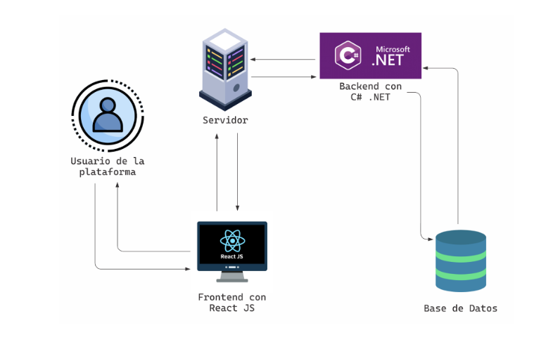
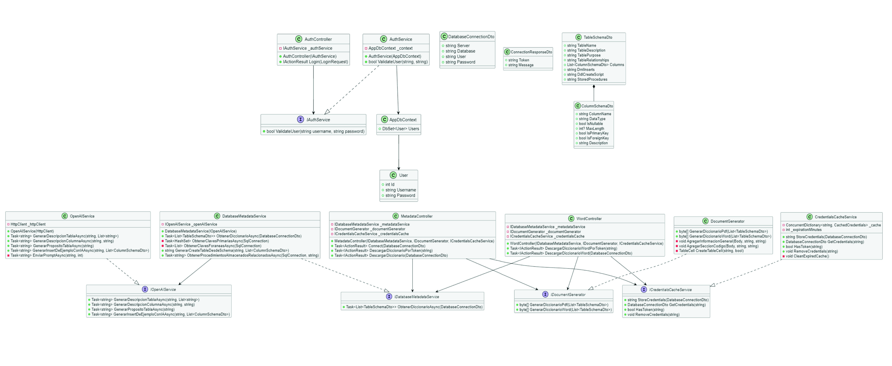
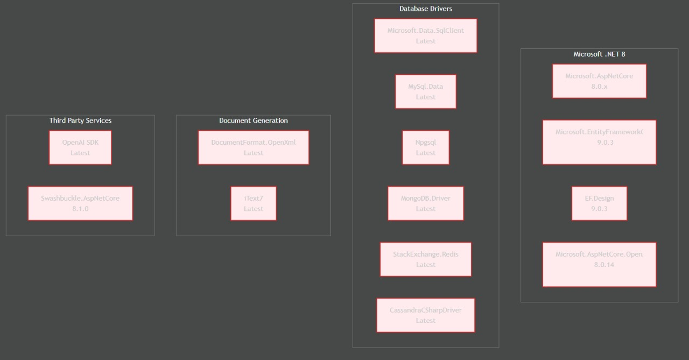
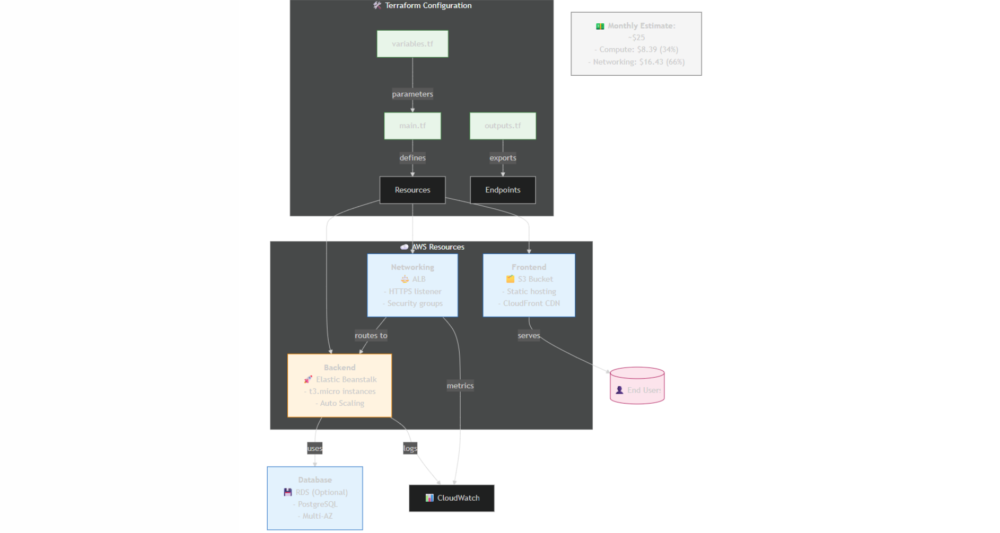

# PROYECTO APLICACION PARA LA GENERACION AUTOMATIZADA DE UN DICCIONARIO DE DATOS
 

### Curso : **Patrones de Software**

### Integrantes :
- **Flores Melendez Andree Sebastian**
- **Flores Ramos Mario Anthonio**
- **Fernandez Villanueva Daleska Fernandez**

---

## Descripción del Problema

Actualmente, muchos desarrolladores y administradores de bases de datos deben documentar manualmente la estructura de sus sistemas, lo que consume tiempo, es propenso a errores y a menudo termina desactualizado. Esta falta de documentación clara complica el mantenimiento y dificulta la comprensión del sistema por parte de otros profesionales. Este proyecto busca resolver esa necesidad mediante una solución que automatice la generación de diccionarios de datos, optimizando tiempo y mejorando el acceso a la información técnica.

---

## Descripción del Sistema
Se desarrollará una aplicación web capaz de conectarse a bases de datos como SQL Server para analizar su estructura y generar automáticamente un diccionario de datos organizado y visual. La herramienta está diseñada para facilitar el trabajo de desarrolladores, administradores de bases de datos y estudiantes, brindando una forma rápida y precisa de documentar la arquitectura de cualquier base de datos.

---

## Diagrama de Arquitectura de software

---

## Diagrama de Clases

---

## Diagrama de Componentes

---

## Diagrama de Despliegue

---

## Analisis Economico Terraform

